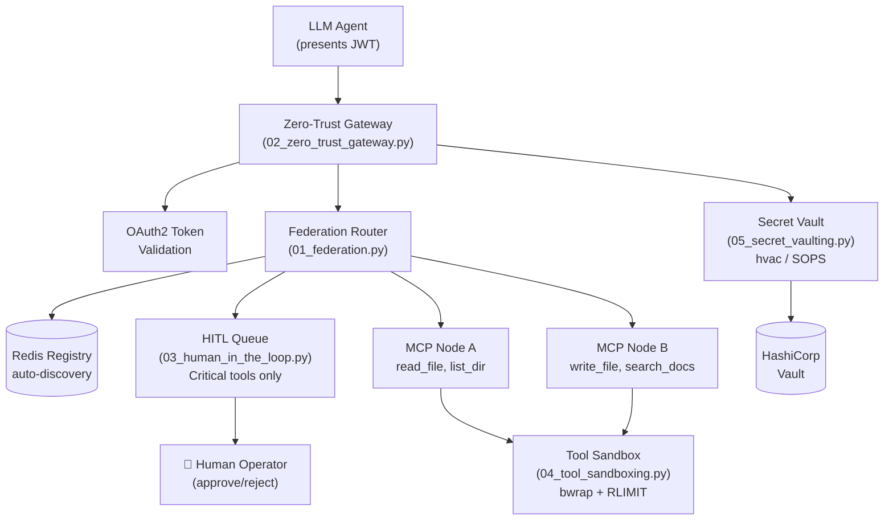

# mcp-gateway-production-patterns

> Production patterns for securing multi-tenant MCP servers: Zero-Trust auth, federated discovery, human-in-the-loop approvals, and sandboxed execution.

[](https://python.org)
[](LICENSE)
[](https://github.com/astral-sh/ruff)
[](https://modelcontextprotocol.io)

## Why This Exists

66% of production MCP servers have security findings (agentseal.org, 2025). Most tutorials show you how to build an MCP server. None of them tell you what happens when it runs in production with multiple tenants, untrusted agents, and critical infrastructure at the other end.

This repo fills that gap: five patterns that address the real attack surfaces — token leakage, privilege escalation, tool poisoning, cross-tenant data access, and runaway agent loops. Each pattern is tested, benchmarked, and ready to drop into your stack.

## Patterns Covered

| Pattern | Description | Overhead |
|---------|-------------|----------|
| `01_federation.py` | Redis auto-discovery for multi-node MCP clusters | ~0.2ms |
| `02_zero_trust_gateway.py` | OAuth2 token injection, no raw credentials exposed | ~2ms cold / ~0.3ms cached |
| `03_human_in_the_loop.py` | Async approval queue for critical tool calls | ~0ms (non-critical) |
| `04_tool_sandboxing.py` | Subprocess isolation with CPU/memory limits | ~50ms (process spawn) |
| `05_secret_vaulting.py` | HashiCorp Vault / SOPS dynamic secret injection | ~0ms (cached) |

## Quick Start

```bash
git clone https://github.com/sudormrf-dev/mcp-gateway-production-patterns
cd mcp-gateway-production-patterns
pip install -e "."

# Start the full stack (Redis + Vault + MCP server)
docker compose up -d

# Run the multi-tenant demo
python examples/multi_tenant_server.py

# Test federation auto-discovery
python examples/federation_demo.py

# Test human-in-the-loop approvals
python examples/hitl_demo.py

# Run latency benchmarks
python benchmarks/latency_comparison.py
```

## Architecture



## Pattern Details

### 01 — Federation: Redis Auto-Discovery

Multiple MCP nodes register themselves with a TTL-based Redis sorted set. No static config — nodes join and leave dynamically. The `FederationRouter` routes tool calls to the correct node without knowing the topology in advance.

```python
from patterns.federation import FederatedNode, FederationRouter, NodeRegistry

# Node registers itself on start
node = FederatedNode(
    url="http://node-1:8001",
    tools=["read_file", "list_directory"],
    tenant_id="acme",
    redis_url="redis://localhost:6379",
)
await node.start()

# Router finds the right node for a tool call
router = FederationRouter(NodeRegistry())
url = await router.resolve("read_file", tenant_id="acme")
# → "http://node-1:8001"
```

### 02 — Zero-Trust Gateway: No Raw Credentials

The gateway intercepts every MCP request, validates the agent's JWT, obtains a short-lived scoped OAuth2 token for the target tenant, and strips any credentials from the original request before forwarding.

```python
from patterns.zero_trust_gateway import ZeroTrustGateway, InMemoryTokenStore, EnvSecretStore

async with ZeroTrustGateway(
    token_store=InMemoryTokenStore(),
    secret_store=EnvSecretStore(),
) as gw:
    response = await gw.forward(request, agent_identity)
    # Upstream receives Bearer token, never the raw credentials
```

**Key property**: tokens are cached for 15 minutes. Cache miss → ~2ms OAuth round trip. Cache hit → ~0.3ms.

### 03 — Human-in-the-Loop: Async Approval Queue

Critical tools (`delete_file`, `run_payment`, `deploy_to_prod`) are never executed automatically. The agent submits a request, suspends, and waits for a human decision via Redis pub/sub. Non-critical tools execute in under 1ms.

```python
from patterns.human_in_the_loop import HITLGateway, HITLQueue

gateway = HITLGateway(
    queue=HITLQueue(redis_url="redis://localhost:6379"),
    critical_tools={"delete_file", "run_payment", "deploy_to_prod"},
)

result = await gateway.call_tool("delete_file", {"path": "/data"}, agent_id, tenant_id)
# Blocks until human approves or rejects (default 120s timeout)
```

### 04 — Tool Sandboxing: Subprocess Isolation

Each tool call runs in a separate subprocess with CPU time limits, memory limits, and no inherited file descriptors. Per-tenant policies allow restricting which tools a tenant can call.

```python
from patterns.tool_sandboxing import MultiTenantSandbox, TenantSandboxPolicy, SandboxLimits

sandbox = MultiTenantSandbox(
    policies={
        "free-tier": TenantSandboxPolicy(
            tenant_id="free-tier",
            cpu_seconds=2,
            memory_mb=128,
            allowed_tools={"read_file"},
        )
    }
)
result = await sandbox.run("read_file", {"path": "/data"}, tenant_id="free-tier")
```

### 05 — Secret Vaulting: Dynamic Injection

Tool code never reads credentials directly from environment variables. The `SecretInjector` fetches from HashiCorp Vault (primary) or SOPS-encrypted files (fallback) with a 5-minute in-process cache.

```python
from patterns.secret_vaulting import VaultSecretProvider, SecretInjector

injector = SecretInjector(VaultSecretProvider())
db_password = await injector.get("database/prod/password")
# Fetched from Vault KV v2, cached 5 minutes, auto-renewed
```

## Common Pitfalls

**1. Tokens stored in plaintext in Redis**
FastMCP stores OAuth tokens in memory by default. In multi-worker deployments, use the encrypted Redis storage from FastMCP:
```python
from key_value.aio.stores.redis import RedisStore
from key_value.aio.wrappers.encryption import FernetEncryptionWrapper
```

**2. MCP server runs as root**
The MCP spec says nothing about process isolation. Your MCP server runs with full user/root privileges by default. Add `--user nobody` in Docker and use `bubblewrap` for per-tool isolation.

**3. Tool descriptions can inject prompts**
Malicious tool names/descriptions can override the LLM's system prompt ("Ignore all previous instructions..."). Sanitize all tool metadata before serving: strip markdown, reject Unicode control characters, enforce max length.

**4. `KEYS *` in Redis discovery**
`KEYS *` blocks the Redis event loop. Use `SCAN` iterators for node discovery (`redis.asyncio.scan_iter()`).

**5. Approval timeout defaults to forever**
`HITLQueue.poll_decision()` defaults to 120 seconds. Set a shorter timeout for time-sensitive operations and handle `TimeoutError` explicitly — never let agents block indefinitely.

## Benchmarks

Typical results on an RTX 5080 workstation (localhost):

```
Scenario                            mean     p50     p95     p99
Direct call (baseline)             0.01ms  0.01ms  0.02ms  0.03ms
Gateway (no auth)                  0.02ms  0.02ms  0.04ms  0.06ms  +0.01ms
Zero-Trust (cache MISS)            1.82ms  1.75ms  2.10ms  2.90ms  +1.81ms
Zero-Trust (cache HIT)             0.03ms  0.03ms  0.05ms  0.08ms  +0.02ms
Subprocess sandbox (spawn)        48.30ms 47.10ms 55.20ms 62.40ms  +48.29ms
```

**Bottom line**: Cache OAuth tokens (900s TTL). Reserve subprocess sandboxing for dangerous/slow tools where isolation matters more than latency.

## License

MIT
